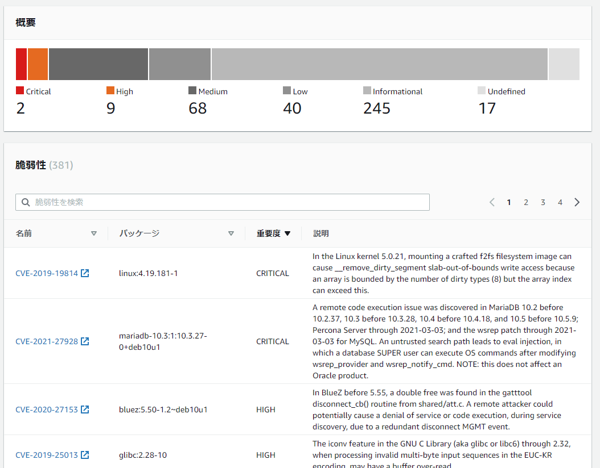
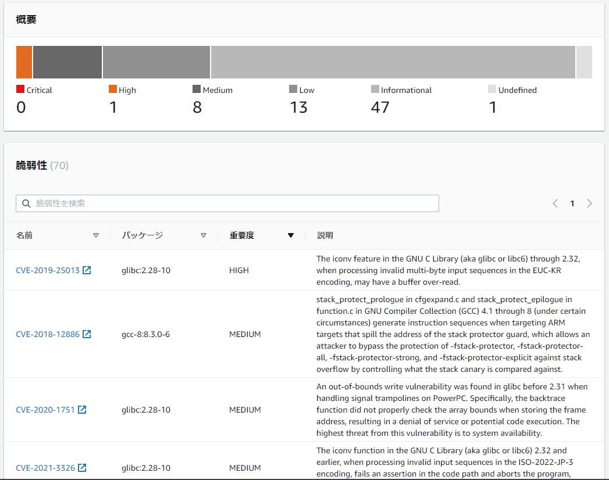

マルチステージビルドを利用して軽量、セキュアなPython実行環境用コンテナイメージのサンプル

- 使用ライブラリ
    - django
    - django-auth-ldap

※django-auth-ldapの依存関係で必要となる`python-ldap`がインストール時にビルドを伴うため例として選定。

(超)参考: [仕事でPythonコンテナをデプロイする人向けのDockerfile (1): オールマイティ編 | フューチャー技術ブログ](https://future-architect.github.io/articles/20200513/)

```shell
$ docker build . -t awesome-image
```

# 脆弱性スキャン結果の違い

Amazon ECR イメージスキャン(Clair)による脆弱性スキャン結果の違い

※2021/4/6時点

## python:3.8.8-buster

### Dockerfile

```Dockerfile
FROM python:3.8.8-buster
RUN apt-get update && \
    apt-get -y upgrade
```

### スキャン結果

| Sevirity      | Num |
| ------------- | --: |
| CRITICAL      |   2 |
| HIGHT         |   9 |
| MIDIUM        |  68 |
| LOW           |  40 |
| INFORMATIONAL | 245 |
| Total         | 381 |




## awesome-image

### Dockerfile

- [Dockerfile](./Dockerfile)

### スキャン結果

| Sevirity      | Num |
| ------------- | --: |
| CRITICAL      |   0 |
| HIGHT         |   1 |
| MIDIUM        |   8 |
| LOW           |  13 |
| INFORMATIONAL |  47 |
| UNDEFINED     |   1 |
| Total         |  70 |



